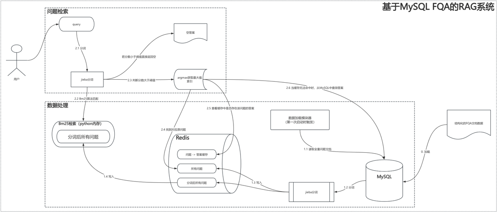
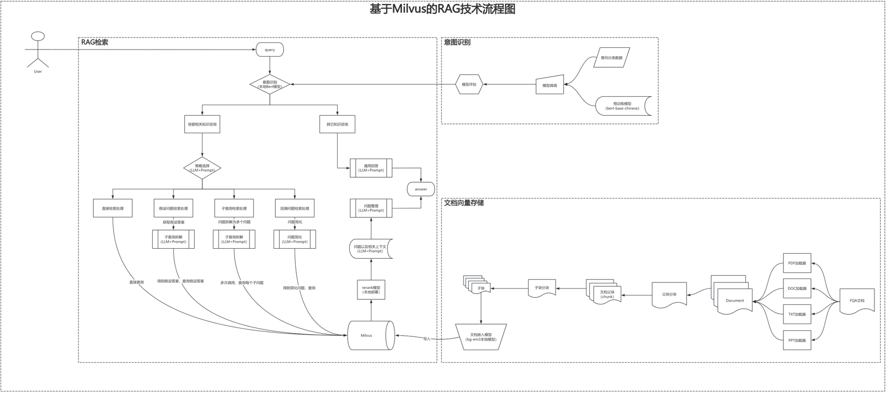
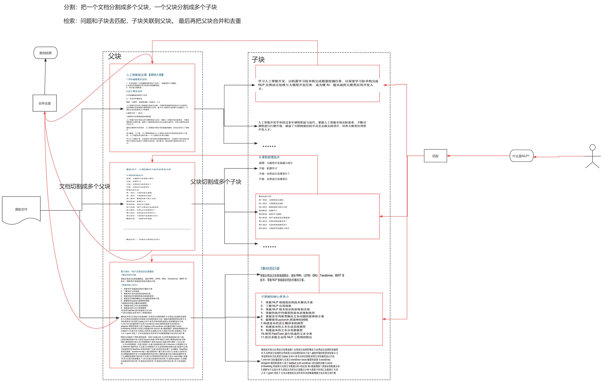

# rag_system
搭建一个rag系统，逐步构建完善，多方案尝试

启动redis以及milvus ,先启动docker桌面程序
```shell
cd /Users/erainm/Documents/application/dev/developed/milvus_redis

docker compose up -d

docker ps

docker compose down
```

# 一、基于MySQL实现简单的RAG系统

目的为了提高系统的性能，将高频的问题总结并精确处理为结构化数据，保存到MySQL中
## 技术流程图


# 二、基于Milvus实现RAG系统

## 技术流程图


## 文档切块以及检索流程
